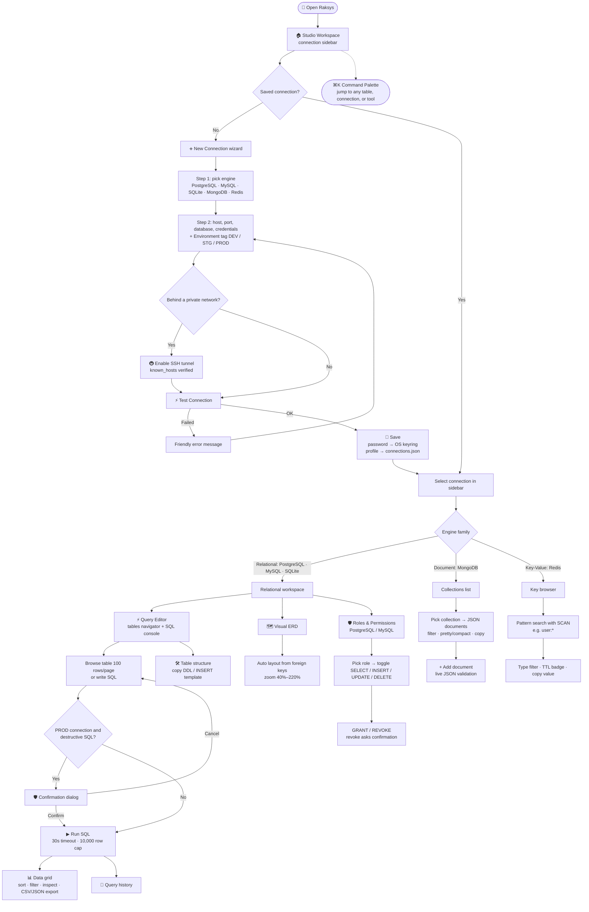

# Raksys ⚡

<p align="center">
  <strong>Native, Privacy-First Database Studio for Desktop</strong><br>
  <em>One window for PostgreSQL, MySQL, SQLite, MongoDB, and Redis — with SSH tunnels, OS-keyring credentials, and production safeguards built in.</em>
</p>

<p align="center">
  
  
  
  
  
  
  <a href="https://saweria.co/izarakuro"></a>
  <a href="https://ko-fi.com/izarakuro"></a>
</p>

---

## 🔒 Privacy & Zero-Data Collection Guarantee

> [!IMPORTANT]
> ### 🛡️ Developer Privacy Mandate
> Raksys **does not collect, transmit, or store any telemetry or private information**. It contains no analytics SDK and never phones home.
> - **Local-only processing**: queries, results, schema metadata, and history live in memory on your machine. The only network traffic Raksys generates is the connection *you* configure to *your* database (optionally through *your* SSH bastion).
> - **Credentials in the OS keyring**: database and SSH passwords are stored in Apple Keychain / Windows Credential Manager / Secret Service — never in plain text and never in `connections.json`.
> - **Nothing leaves the app**: no crash reporting, no update pings, no remote servers.

See [`SECURITY.md`](SECURITY.md) for the full security model.

---

## 🧭 How Raksys Works (Flow Diagram)

The diagram below shows the whole user journey: from opening the app, to connecting, to the tools that appear depending on the database type you pick.



**Reading the diagram**

| Step | What happens |
|---|---|
| **Connect** | Pick an engine, fill the details, optionally tunnel through SSH, test, and save. Secrets go to the OS keyring, never to disk in plain text. |
| **Choose a workspace** | The engine family decides the tools you see: SQL tools, document browser, or key browser. |
| **Work safely** | On `PROD`-tagged connections, risky SQL always asks for confirmation before running. |
| **Navigate fast** | `⌘K` / `Ctrl+K` reaches any table, connection, or tool from anywhere. |

---

## 🚀 Feature Tour

### 🏠 1. Studio Workspace & Multi-Engine Connections
- **One Window, Five Engines**: PostgreSQL, MySQL/MariaDB, SQLite, MongoDB, and Redis share one connection sidebar and one workflow.
- **Environment Tags**: mark every connection as `DEV`, `STG`, or `PROD` — the tag is color-coded in the connection list, the query toolbar, and the bottom status bar so you never confuse staging with production.
- **Resizable, Collapsible Panels**: drag the splitters to resize the sidebar and navigator, or hide the sidebar with `⌘B` / `Ctrl+B`.
- **Duplicate, Edit & Delete**: clone any connection profile (including its keyring secrets) in one click; deletion always asks for confirmation.

---

### 🔌 2. Guided Connection Wizard
- **Two-Step Wizard**: pick the engine first, then fill only the fields that engine needs (SQLite asks for a file path; Redis asks for a database index 0–15; MongoDB requires a database name).
- **Inline "Test Connection"**: verify host, port, and credentials *before* saving, with a friendly result banner.
- **Create-Database-on-Connect**: for PostgreSQL and MySQL, flip *"Buat Database Baru di Server Ini"* and Raksys issues `CREATE DATABASE` for you, then saves the profile.
- **Quick Local DB**: a one-dialog shortcut for spinning up a local PostgreSQL / MySQL database or a fresh SQLite file.
- **Human-Readable Errors**: connection refused, DNS failures, timeouts, bad passwords, and SSL mismatches are translated into actionable messages instead of driver stack traces.

---

### 🚇 3. SSH Tunnel (Bastion) Support
- **Private-Network Access**: reach databases behind a jump host with a local port-forward — works for every engine (JDBC, MongoDB, Redis).
- **Password or Private-Key Auth**: authenticate to the bastion with a password (stored in the keyring) or a `.pem` / `.rsa` key file.
- **Strict Host-Key Verification**: the bastion's host key is verified against your own `~/.ssh/known_hosts`. Unknown hosts are **refused**, not silently trusted.

---

### ⚡ 4. SQL Console with Syntax Highlighting
- **RSyntaxTextArea Editor**: SQL syntax highlighting and one-click **⚡ Format** (uppercases keywords and tidies clauses).
- **Run / Cancel**: `⌘↵` / `Ctrl+↵` runs the query; **Cancel** aborts the in-flight statement.
- **Safety Rails**: 30-second query timeout and a **10,000-row result cap** (with a visible "truncated" notice) keep a runaway `SELECT *` from freezing the app.
- **Status Bar**: live state — idle, running, success (row count + execution time in ms), or failure with the database's error message.

---

### 📜 5. Query History
- **Automatic Log**: the last 100 executed statements are recorded with success/failure state, execution time, and row count.
- **One-Click Reuse**: **⚡ Muat ke Editor** loads a past query back into the console; **📋 Salin** copies it.
- **Session-Scoped**: history is held in memory only and can be cleared at any time.

---

### 📊 6. Data Grid & Table Browser
- **Schema Navigator**: filterable list of tables with column counts. Right-click actions: **Open Data (100 rows)**, **Copy Table Name**, **Copy SELECT Query**, **Copy DDL Template**.
- **Paginated Browsing**: 100 rows per page with **‹ Prev / Next ›** controls, generated with safe `LIMIT/OFFSET` queries.
- **Sortable, Filterable Grid**: click a header to sort ▲/▼, use the row filter to narrow results, and click any cell to inspect long values.
- **Export in One Click**: copy the visible rows as **CSV** or **JSON** to the clipboard.

---

### 🛠️ 7. Table Structure Inspector
- **Column-Level Detail**: type, `🔑 PK` badges, `🔗 FK → table.column` badges, `NULL` / `NOT NULL`, and default values.
- **Filter Columns & Types**: instant search across column names and data types.
- **Copy DDL / INSERT Template**: generate a `CREATE TABLE` statement or an `INSERT … VALUES (?)` template from the live schema.

---

### 🛡️ 8. Production Safeguard
- **Destructive-SQL Detection**: on connections tagged **PRODUCTION**, statements such as `DROP TABLE/DATABASE/SCHEMA/VIEW/INDEX`, `TRUNCATE`, `DELETE` without `WHERE`, `UPDATE` without `WHERE`, and `ALTER TABLE … DROP` require an explicit confirmation dialog that shows the exact SQL first.
- **Zero Friction Elsewhere**: DEV and STG connections run without extra prompts.

---

### 🗺️ 9. Visual ERD
- **Auto-Generated Diagram**: tables are laid out automatically from live foreign-key metadata and connected with Bézier relationship edges.
- **Zoom Controls**: zoom from 40% to 220% or reset to 100%.
- **Always in Sync**: the diagram is built directly from the connected database — no separate model file to maintain.

---

### 🔐 10. Roles & Permissions Matrix (PostgreSQL / MySQL)
- **Real Catalog Data**: roles come from `pg_roles` / `information_schema`; privileges from each engine's grant tables.
- **Per-Table Matrix**: toggle `SELECT`, `INSERT`, `UPDATE`, and `DELETE` per role per table — Raksys issues the real `GRANT` / `REVOKE`.
- **Bulk Actions & Search**: filter tables and grant or revoke **all** privileges on a table with one click.
- **Confirm Before Revoke**: a *"Cabut Akses?"* dialog prevents accidental privilege removal.
- **Role Badges**: `superuser` and `no login` roles are flagged.

---

### 🍃 11. MongoDB Document Browser
- **Collection Explorer**: searchable list of collections with approximate document counts.
- **JSON Viewer**: browse documents with pretty / compact toggle, filter by `_id` or keyword, and copy any document's JSON.
- **Add Documents**: insert new documents with a live **JSON validity** indicator and a built-in **Rapi JSON** formatter.

---

### 🔑 12. Redis Key Browser
- **Non-Blocking Key Scan**: uses cursor-based `SCAN` (never `KEYS *`) with a glob pattern such as `user:*`.
- **Type-Aware Values**: `string`, `hash`, `list`, `set`, and `zset` values are rendered as readable text/JSON, with **TTL** badges.
- **Type Filter Chips**: filter by type and see per-type counts at a glance.

---

### ⌨️ 13. Command Palette
- **`⌘K` / `Ctrl+K`** opens a fuzzy launcher for **tables**, **connections**, and **navigation** (SQL Console, ERD, Permissions, New Connection, Toggle Sidebar).
- Fully keyboard-driven: `↑` / `↓` to move, `↵` to run, `Esc` to close.

---

## 🧭 Feature Matrix

| Capability | PostgreSQL | MySQL / MariaDB | SQLite | MongoDB | Redis |
|---|:-:|:-:|:-:|:-:|:-:|
| Connection profile + keyring password | ✅ | ✅ | ✅ (file path) | ✅ | ✅ |
| SSL / TLS option | ✅ | ✅ | — | ✅ | — |
| SSH tunnel | ✅ | ✅ | — | ✅ | ✅ |
| Create database from the wizard | ✅ | ✅ | ✅ (auto file) | — | — |
| Schema navigator & table browser | ✅ | ✅ | ✅ | Collections | Keys |
| SQL console, history & export | ✅ | ✅ | ✅ | — | — |
| Table structure inspector | ✅ | ✅ | ✅ | — | — |
| Visual ERD | ✅ | ✅ | ✅ | — | — |
| Roles & permissions (GRANT / REVOKE) | ✅ | ✅ | — | — | — |
| Production destructive-SQL safeguard | ✅ | ✅ | ✅ | — | — |
| Document insert / JSON viewer | — | — | — | ✅ | — |
| Key scan with TTL & type filter | — | — | — | — | ✅ |

**Default ports**: PostgreSQL `5432` · MySQL `3306` · MongoDB `27017` · Redis `6379`.

---

## 💻 Supported Platforms & Requirements

| Platform | Package | Credential storage |
|---|---|---|
| **macOS** (Apple Silicon & Intel) | `.dmg` | Apple Keychain |
| **Windows** | `.exe` | Windows Credential Manager |
| **Linux** (run from source) | `./gradlew :app:run` | Secret Service (GNOME Keyring / KWallet) |

### 📋 Minimum Requirements
- **JDK 17+** to build and run from source (installers bundle their own runtime).
- **Network reachability** to the database you want to manage (directly or through an SSH bastion).
- **Linux only**: a running Secret Service provider so credentials can be saved.

---

## 📦 Installation & Quick Start

### Option 1: Installer (Recommended)

Download the installer for your OS from the [**Releases**](../../releases/latest) page and follow the step-by-step guide in [**`DOWNLOAD.md`**](DOWNLOAD.md).

### Option 2: Build from Source (Developers)

Prerequisites: **JDK 17+** and Git. The Gradle wrapper downloads everything else.

```bash
# 1. Clone the repository
git clone https://github.com/faizazharr/Raksys.git
cd Raksys

# 2. Run the app
./gradlew :app:run

# 3. Run the test suite
./gradlew test

# 4. Package a native installer for your current OS (.dmg on macOS, .exe on Windows)
./gradlew :app:packageDistributionForCurrentOS
```

Installers are written to `app/build/compose/binaries/main/`.

---

## 🧱 Tech Stack

| Layer | Technology |
|---|---|
| Language / Build | Kotlin 2.4, Gradle 8.11 (Kotlin DSL + version catalog), JDK 17 toolchain |
| UI | Compose Multiplatform Desktop 1.12 (Material 3, dark theme) |
| Dependency Injection | Koin |
| Async | Kotlin Coroutines (+ Swing dispatcher) |
| Relational | HikariCP pools · PostgreSQL JDBC · MySQL Connector/J · SQLite JDBC |
| Document / Key-Value | MongoDB Java Sync Driver · Jedis |
| SSH | SSHJ |
| Credentials | java-keyring |
| SQL Editor | RSyntaxTextArea |
| Persistence | `kotlinx.serialization` JSON (`~/.raksys/connections.json`) |

For module boundaries and design patterns, read [**`ARCHITECTURE.md`**](ARCHITECTURE.md).

---

## 🗺️ Project Roadmap & Community

- View upcoming milestones in [**`ROADMAP.md`**](ROADMAP.md).
- See what changed in [**`CHANGELOG.md`**](CHANGELOG.md).
- Report bugs or request features in [**GitHub Issues**](../../issues).
- Our community follows the Contributor Covenant in [**`CODE_OF_CONDUCT.md`**](CODE_OF_CONDUCT.md).

---

## 🤝 Contributor Guidelines & Standards

1. **Strict Zero-Telemetry Policy** — never add analytics, tracking SDKs, or unsolicited network calls.
2. **Unidirectional Event Flow (Presenter + Event + UiState)** — screens dispatch events to a presenter; the presenter exposes a `StateFlow<UiState<T>>`. See [`ARCHITECTURE.md`](ARCHITECTURE.md).
3. **Modular by Feature** — each feature is its own Gradle module; drivers are consumed through interfaces registered in Koin.
4. **Secrets Never Touch Disk in Plain Text** — passwords go through `CredentialStore` (OS keyring) only.
5. **Safety First for Data** — anything that mutates production data must remain guarded and confirmable.
6. **Tests for Pure Logic** — validators, URL builders, layouts, and formatters ship with unit tests.

Full workflow, code style, and PR checklist: [**`CONTRIBUTING.md`**](CONTRIBUTING.md) · release process: [**`RELEASING.md`**](RELEASING.md).

---

## ☕ Support & Donations

Raksys is a free, ad-free, and telemetry-free open-source project. If it helps you manage your databases, please consider supporting ongoing development and maintenance:

<p align="center">
  <a href="https://saweria.co/izarakuro">
    
  </a>
  &nbsp;&nbsp;
  <a href="https://ko-fi.com/izarakuro">
    
  </a>
</p>

- 🇮🇩 **Local Indonesia (Saweria)**: [**https://saweria.co/izarakuro**](https://saweria.co/izarakuro) *(Supports QRIS, GoPay, OVO, DANA, LinkAja, ShopeePay)*
- 🌍 **International (Ko-fi)**: [**https://ko-fi.com/izarakuro**](https://ko-fi.com/izarakuro) *(Supports PayPal, Credit/Debit Cards, Apple Pay, Google Pay)*

Every contribution goes toward new features, testing against more database versions, and keeping the project open and privacy-focused. Thank you! 🙏

---

## 📄 License & Copyright

Copyright © 2026 **Faiz Azhar**. All rights reserved unless a `LICENSE` file states otherwise.
